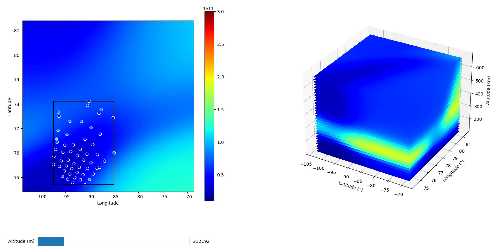

# volumetric_interp_ML
Artificial neural network model for volumetric interpolation.  This is designed to be used with data from the Advanced Modular Incoherent Scatter Radars (AMISR).

# How to use.
1. Open the model.py file.
2. Define the inputs: data_file (h5 RISR file), start and end times. A sample input h5 file has been uploaded to the github for testing.
3. If you want to change some of the model parameters, scroll all the way down and modify those inside the volumetric_nn function. Refer to the function's doctring for a description of each parameter. 
4. Run the model.py file.

# Output.
3D:

Video:

